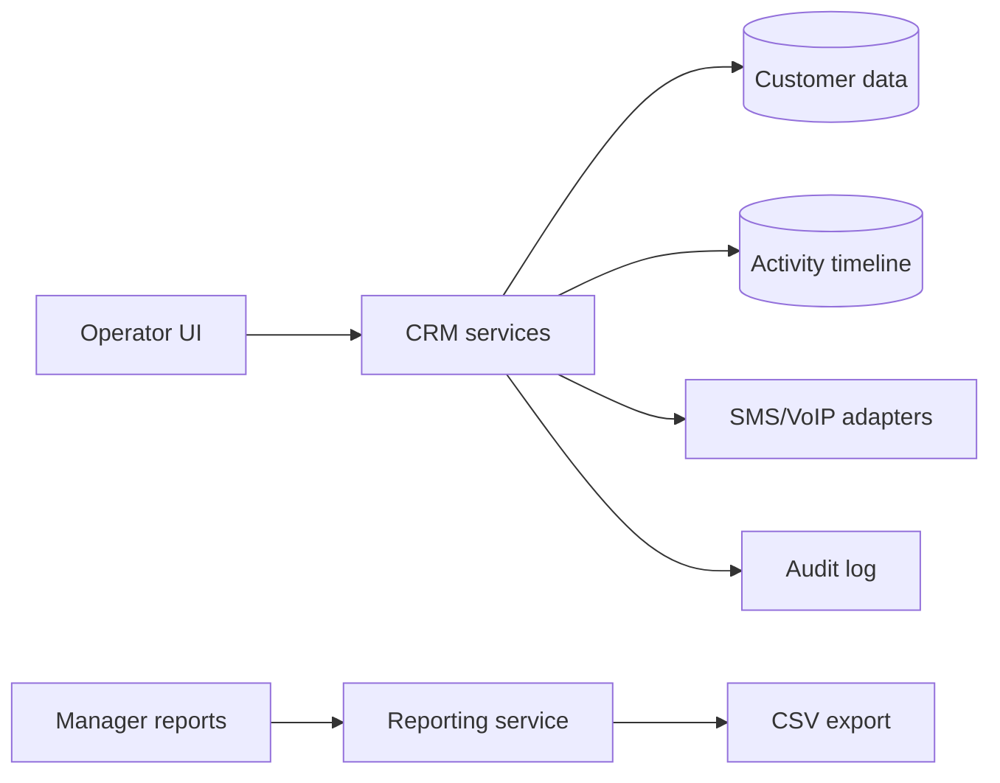

# A2 CRM Operations System

## Overview

Public showcase for a WordPress-based CRM and customer operations architecture built around operator workflows, sales follow-up, customer visibility, reporting, and provider integrations.

## Problem

Sales and support operations were spread across disconnected channels. Operators needed a single place to see customer context, messages, tasks, order history, follow-up state, and management reporting without exposing the full WordPress admin surface.

## Technical Approach

- Modular WordPress plugin architecture with service classes and repositories.
- Role/capability boundaries for operators, managers, and admins.
- Customer hub with activity timeline and assignment state.
- SMS/VoIP provider abstraction.
- Reporting tables and CSV exports for management visibility.
- Audit-friendly operational events.

## Key Features

- Operator inbox
- Chat/customer tracking
- SMS provider abstraction
- VoIP integration boundary
- Customer hub
- Role/capability system
- Reporting and backups

## Performance / Business Impact

Business value: replaced scattered operational handling with a structured internal system for sales follow-up, customer visibility, reporting, and workflow control.

## Architecture

## Code Samples

- `samples/sample-service-class.php`
- `samples/sample-admin-page.php`

## Security & Privacy Notes

No production customer data, messages, phone numbers, provider credentials, or internal workflows are included.

## Tech Stack

PHP, WordPress, MySQL, REST API, JavaScript, SMS/VoIP provider abstraction.

## Related Links

- Portfolio: https://amiraliyaghouti.com
- GitHub profile: https://github.com/shiny-a2

