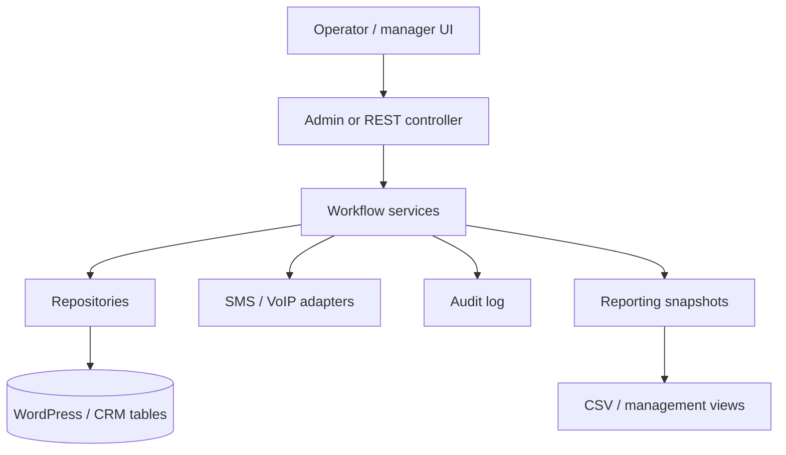

# A2 CRM Operations System

Public-safe architecture case study for a WordPress-based CRM/customer operations system.

This repository documents architecture and representative samples only. It does not contain production customer data, provider credentials, messages, phone numbers, or private workflow logic.

## Overview

The system represented here turns WordPress from a content/admin surface into an operational workspace for sales and customer follow-up. The engineering problem is not only CRUD. It is assignment state, customer context, operator workload, provider failure, reporting, and auditability.

## Production Context

- Sales and support work happened across multiple operational channels.
- Operators needed customer history, task state, follow-up context, and role-specific access.
- Managers needed reporting without asking developers for ad hoc exports.
- SMS/VoIP-style integrations had to remain provider-abstracted and replaceable.

## Problem

Disconnected workflows make customer operations slow and hard to supervise. The system needed a controlled CRM layer inside the WordPress/WooCommerce environment without exposing the full admin surface to every operator.

## Operational Constraints

- Keep customer data access role-bound.
- Avoid storing provider secrets in code.
- Keep audit trails for important operational changes.
- Make reporting useful without turning every dashboard request into a heavy live query.
- Keep public documentation anonymized.

## Scaling Challenges

- Operator inboxes become noisy without assignment and state boundaries.
- Customer timelines can become expensive if every view rebuilds live history.
- Provider integrations fail in ways that need retry, visibility, and graceful degradation.
- Reporting must balance freshness with database cost.

## Architecture Decisions

- Service classes own workflow rules.
- Repository classes own database access.
- Provider adapters isolate SMS/VoIP implementation details.
- Audit logging is treated as a core path, not a debug feature.
- Admin UI is scoped by capability and screen context.

## Architecture Map

## Tradeoffs

- Keeping CRM inside WordPress reduces integration friction but requires strict capability design.
- Snapshot reporting reduces query pressure but introduces freshness decisions.
- Provider abstraction adds code structure but prevents the system from being locked to one vendor.
- Detailed audit logs increase storage but make operational review possible.

## Failure Prevention

- Capability checks before every write.
- Nonce checks for admin actions.
- Provider adapters fail closed and return structured status.
- Audit records store what changed without exposing private message content in public samples.
- Reporting queries are separated from high-frequency operator interactions.

## Performance Strategy

- Use repository methods for bounded reads.
- Avoid loading full customer history unless the view requires it.
- Keep reporting data exportable without forcing live dashboard rebuilds.
- Separate provider calls from UI rendering where possible.

## Operational Learnings

- A CRM is only useful if operators trust its state.
- Internal tools need less visual decoration and more predictability.
- Auditability matters most during exceptional customer or order cases.
- Provider integrations should be treated as unreliable network boundaries.

## Future Improvements

- Add sanitized screenshots of operator inbox states.
- Add a public test fixture for assignment and capability rules.
- Add a changelog for public architecture revisions.

## Code Samples

- assignment service;
- repository layer;
- provider adapter;
- audit logger;
- admin page boundary.

## Security & Privacy Notes

Production customer data, phone numbers, messages, provider credentials, internal workflows, and private logs are excluded.

## Tech Stack

PHP, WordPress, WooCommerce, MySQL, REST/admin AJAX, JavaScript, SMS/VoIP provider abstraction.

## Related Links

- Portfolio: https://amiraliyaghouti.com
- Projects: https://amiraliyaghouti.com/projects.html
- GitHub profile: https://github.com/shiny-a2

