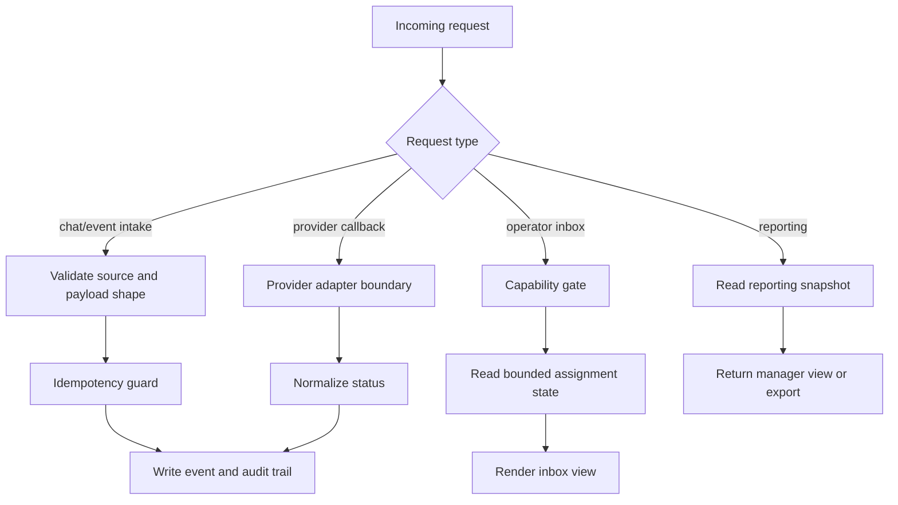

# Request Lifecycle

The CRM path is an operational state path. Reads, writes, callbacks, audit events, and reports should not all behave like the same request.

## Operating Notes

- Provider callbacks are network-boundary events, not trusted internal writes.
- Operator inbox reads should be bounded and state-aware.
- Reporting should read snapshots where possible instead of rebuilding every view from live operational tables.
- Audit writes belong on important state transitions, not only on error paths.

